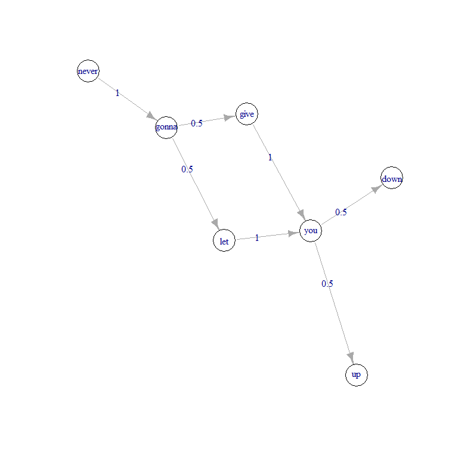

<!-- README.md is generated from README.Rmd. Please edit that file -->

# discrete.time.markov

<!-- badges: start -->
<!-- badges: end -->

Applies the discrete time Markov model (Markov chain) to analyze data by
computing probabilties of transitions between different states.

Inspired by my Stochastic Models in Management module, as well as my
Honors Dissertation, taken in the National University of Singapore (NUS)
Business School.

## Installation

You can install the released version of discrete.time.markov from my
[GitHub](https://github.com/kaiwei-tan/discrete.time.markov) with:

``` r
library(devtools)
install_github("kaiwei-tan/discrete.time.markov")
```

## Examples

This is a basic example, where we generate a random sequence of states
and calculate their transition probabilities:

``` r
library(discrete.time.markov)

# Generate random sequence of states
set.seed(57)
states <- sample(c('up', 'down', 'same'), 10000, replace=TRUE)

# Create transition probability matrix
get.transition.matrix(states, option='prob', output_type='matrix')
#>           down      same        up
#> down 0.3348044 0.3309797 0.3342159
#> same 0.3324275 0.3324275 0.3351449
#> up   0.3524939 0.3302920 0.3172141
```

Here is another example involving text. Let each word in our example
sentence be considered as a state, and we calculate their transition
probabilities accordingly:

``` r
sentence <- 'the quick, brown fox jumps over the lazy dog.'

# Function ignores mid-sentence punctuation i.e. the comma
# Create transition probability matrix
get.transition.matrix.text(sentence, 1, option='prob', output_type='matrix', punct='none')
#>       brown dog fox jumps lazy over quick the
#> brown     0   0   1     0  0.0    0   0.0   0
#> dog       0   1   0     0  0.0    0   0.0   0
#> fox       0   0   0     1  0.0    0   0.0   0
#> jumps     0   0   0     0  0.0    1   0.0   0
#> lazy      0   1   0     0  0.0    0   0.0   0
#> over      0   0   0     0  0.0    0   0.0   1
#> quick     1   0   0     0  0.0    0   0.0   0
#> the       0   0   0     0  0.5    0   0.5   0
```

Now let’s see what happens when we consider two words in a state and
involve the period at the end (ignoring mid-sentence punctuation, each
symbol counts as a state regardless of the number of words considered as
a state).

``` r
# Create transition probability matrix
get.transition.matrix.text(sentence, 2, option='prob', output_type='matrix', punct='end')
#>             . brown fox fox jumps jumps over lazy dog over the quick brown
#> .           1         0         0          0        0        0           0
#> brown fox   0         0         1          0        0        0           0
#> fox jumps   0         0         0          1        0        0           0
#> jumps over  0         0         0          0        0        1           0
#> lazy dog    1         0         0          0        0        0           0
#> over the    0         0         0          0        0        0           0
#> quick brown 0         1         0          0        0        0           0
#> the lazy    0         0         0          0        1        0           0
#> the quick   0         0         0          0        0        0           1
#>             the lazy the quick
#> .                  0         0
#> brown fox          0         0
#> fox jumps          0         0
#> jumps over         0         0
#> lazy dog           0         0
#> over the           1         0
#> quick brown        0         0
#> the lazy           0         0
#> the quick          0         0
```

We can also use the output of (for text data) or (for non-text), which
return a dataframe of state transitions and their probabilities, with to
get a state transition diagram:

``` r
library(magrittr)
library(igraph)
#> 
#> Attaching package: 'igraph'
#> The following objects are masked from 'package:stats':
#> 
#>     decompose, spectrum
#> The following object is masked from 'package:base':
#> 
#>     union

lyrics <- c('never gonna give you up', 'never gonna let you down')

# Create dataframe of state transitions and probabilities
lyrics_transitions <- get.transitions.text(lyrics, 1, option='prob', punct='none')

# Plot graph
igraph::graph_from_data_frame(lyrics_transitions) %>%
  plot(edge.label=lyrics_transitions$prob, vertex.color='white')
```


